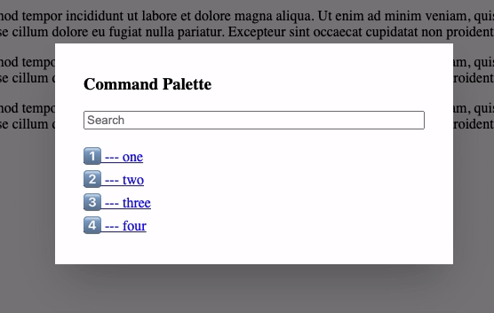

Vue Omnibar
============

> Create modal popups that emulate omnibar, command palette, open anywhere, or other "search and act" functions/features

## Demo



## Features

- [x] built-in filtering using [Fuse.js](https://fusejs.io/)
- [x] custom key combo support
- [x] listens for `esc` key
- [x] bring your own styling (basic styles included)
- [x] arrow key support
- [x] uses slots for best flexibility
- [x] "off-click" closes the modal

## Installation

```bash
npm install vue-omnibar
```

### Global Usage

```js
import Vue from 'vue';
import Omnibar from 'vue-omnibar';

Vue.component('omnibar', Omnibar);
```

### In Single File Components

```js
import Omnibar from 'vue-omnibar';

export default {
  // ...
  components: {
    Omnibar,
  },
  // ...
};
```

## Usage

```vue
<template>
  <div id="app">
    <omnibar :data="data" :initial="data.slice(0, 4)">
      <h3 slot="header">Command Palette</h3>
      <!-- the data to show when nothing has been typed -->
      <!-- if the initial data is empty, nothing is shown -->
      <template #initial="{ initial }">
        <div v-for="item in initial" :key="item" class="omnibar-search-initial-list">
          <a href="#" @click.prevent="handleClick(item)" v-text="item"></a>
        </div>
      </template>
      <!-- the filtered results based on the what is being typed -->
      <template #results="{ results }">
        <div v-for="item in results" :key="item" class="omnibar-search-results-list">
          <a href="#" @click.prevent="handleClick(item)" v-text="item"></a>
        </div>
      </template>
    </omnibar>
  </div>
</template>

<script lang="ts">
import Vue from 'vue';
import Omnibar from '@/omnibar.vue';

export default Vue.extend({
  name: 'OmnibarExample',
  components: {
    Omnibar
  },
  data() {
    return {
      data: [
        '1️⃣ --- one',
        '2️⃣ --- two',
        '3️⃣ --- three',
        '4️⃣ --- four',
        '5️⃣ --- five',
        '6️⃣ --- six',
      ]
    };
  },
  methods: {
    handleClick(item: any) {
      window.alert(item);
    }
  },
});
</script>

<style type="text/css">
.omnibar-search-list a {
  display: inline-block;
  width: 100%;
}
</style>
```

## Opening Programmatically

```vue
<!-- the `openOmnibar` event can be called anyway and will trigger the modal to open -->
<button type="button" @click.prevent="$root.$emit('openOmnibar')">Show Omnibar</button>
```

## Available Props

- *data*: `Array<any | Record<string, any>>` - the data to filter when typing (`required`)
- *initial*: `Array<any | Record<string, any>>` - the data to show when the field is empty (default: `[]`)
- *keybinding*: `Array<string>` - combination of keys that need to be pressed (default: `['shift', 'p']`)
- *shadow*: `boolean` - add a shadow to the view box (default: `true`)
- *overlay*: `boolean` - show an overlay under the view box (default: `true`)
- *options*: `Fuse.IFuseOptions<string>` - options to pass to Fuse.js ([see options page](https://fusejs.io/api/options.html)) (default: `{}`)

## Development

- `npm run serve`: run a development server with a the `serve.vue` page
- `npm run build`: generate the build output
